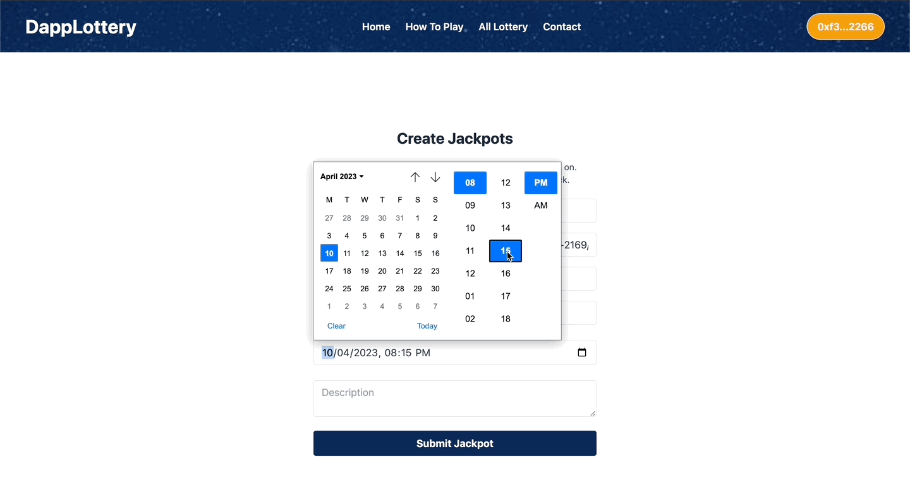
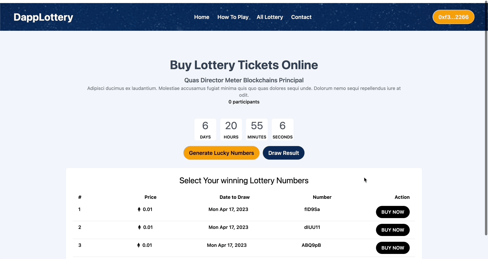
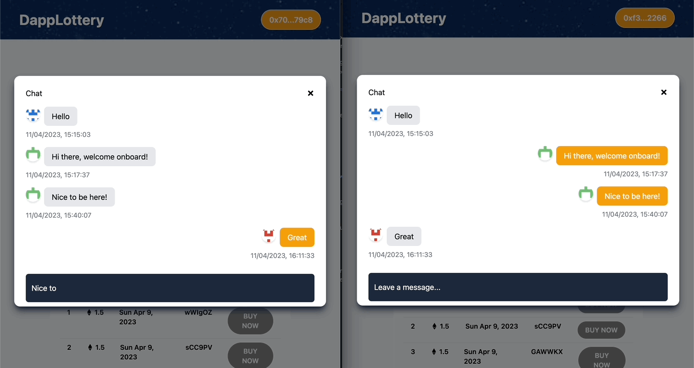

# 🎲 GameFair - The Ultimate Lottery DApp

GameFair is a decentralized lottery application built with Next.js, Solidity, and CometChat on the CreatorChain Testnet. Experience seamless ticket purchasing, live chat, and fair lottery draws powered by smart contracts. 🚀

✨ Features

🎟 Create and Participate in a decentralized lottery

🛒 Purchase Tickets securely with blockchain technology

💬 Live Chat with other participants using CometChat

🔗 Powered by CreatorChain Testnet for fast and low-cost transactions

<div align="center">
  
  <p><strong>Creating a Lottery</strong></p>
</div>

<div align="center">
  
  <p><strong>Purchasing Ticket</strong></p>
</div>

<div align="center">
  
  <p><strong>Live Chat</strong></p>
</div>


## Technology

This demo uses:

- Metamask
- Hardhat
- Infuira
- NextJs
- Tailwind CSS
- Solidity
- EthersJs
- Faucet

## Running the demo

To run the demo follow these steps:

1. Clone the project with the code below.

   ```sh

   # Make sure you have the above prerequisites installed already!
   git clone https://github.com/Gola-k/LuckSphere
   cd dappLottery # Navigate to the new folder.
   yarn install # Installs all the dependencies.
   ```

2. Head to [CometChat](https://try.cometchat.com) and create a project.

3. Create a `.env.local` file to include the following details.
   ```sh
    NEXT_PUBLIC_APP_ID=<APP_ID>
    NEXT_PUBLIC_AUTH_KEY=<AUTH_KEY>
    NEXT_PUBLIC_REGION=<REGION>
   ```
4. Run the app using `yarn dev`
   <br/>

## Adding CrossFi Testnet to MetaMask

1. **Open MetaMask** and click on the network dropdown at the top of the MetaMask window (where it says "Ethereum Mainnet" by default).

2. **Select** "Add Network" at the bottom.

3. In the **Network Name**, enter the following details for the CrossFi testnet:

   - **Network Name**: 
What Are Token Approvals?
How to Revoke Token Approvals
What Are Permit Signatures?
What Is Permit2?
Security & Scams
You’ve Been Scammed, Now What?
Common Scam: Address Poisoning
Wallets
Add a Network to Your Wallet
FAQ
Learn
Wallets
Add Creator Chain Testnet to MetaMask
Add Creator Chain Testnet to MetaMask
Add Creator Chain Testnet to MetaMask
Select the network that you want to add:


Creator Chain Testnet
Creator Chain Testnet
What Is Creator Chain Testnet?
Creator Chain Testnet is a testnet for Creator Chain. Creator Chain is a Layer 2 blockchain that is built using Optimism's OP Stack, so just like Optimism it uses optimistic rollup technology. Creator Chain is focused on providing cheap and fast transactions, while enabling developers to earn a share of the network's revenue. The native token of Creator Chain Testnet is CETH. Learn more about Creator Chain Testnet on its website.

Steps To Add Creator Chain Testnet to MetaMask
The process of adding Creator Chain Testnet to your wallet may be slightly different depending on the wallet you are using. The steps below are for MetaMask. If you are using a different wallet, there is most likely a similar process that you can follow.

1. Open your wallet and go to the "Add network" page.
MetaMask Add Network 1

MetaMask Add Network 2

2. Enter the required details and click "Save".
After entering all the required details, you can click "Save" to add Creator Chain Testnet to MetaMask.

     Network name   Creator Chain Testnet         
   - **New RPC URL**: `[https://rpc.creatorchain.io](
   - **Chain ID**: `66665`
   - **Currency Symbol**: `CETH`
   - **Block Explorer URL**: `[https://explorer.creatorchain.io](https://explorer.creatorchain.io)`

4. **Save** the network configuration.

---

## Getting CETH Tokens for Transactions

To get some CETH tokens for making transactions, follow these steps:

1. Go to the [Creators Faucet](https://creators.faucetme.pro/) (or similar URL if available for the testnet).
2. Enter your **MetaMask wallet address** and request some **CETH tokens** for testing.
3. Once received, you'll be able to use the CETH tokens to interact with the GameFair Lottery DApp.

---

Once these steps are completed, you'll be able to interact with the GameFair Lottery DApp and use CETH tokens for purchasing tickets and participating in lotteries. 

---

**Note**: Make sure your MetaMask is connected to the CrossFi Testnet whenever you interact with the DApp.

## Useful links

- 🏠 [Website](https://gamefare.vercel.app/)
- ⚽ [Metamask](https://metamask.io/)
- 🚀 [Infuria](https://app.infura.io/dashboard/)
- 💡 [Hardhat](https://hardhat.org/)
- 🔥 [NextJs](https://nextjs.org/)
- 🐻 [Solidity](https://soliditylang.org/)
- 👀 [Ethersjs](https://docs.ethers.io/v5/)
- 🎅 [CometChat](https://try.cometchat.com/daltonic)
- ✨ [Live Demo](https://lucks-phere.vercel.app/)
